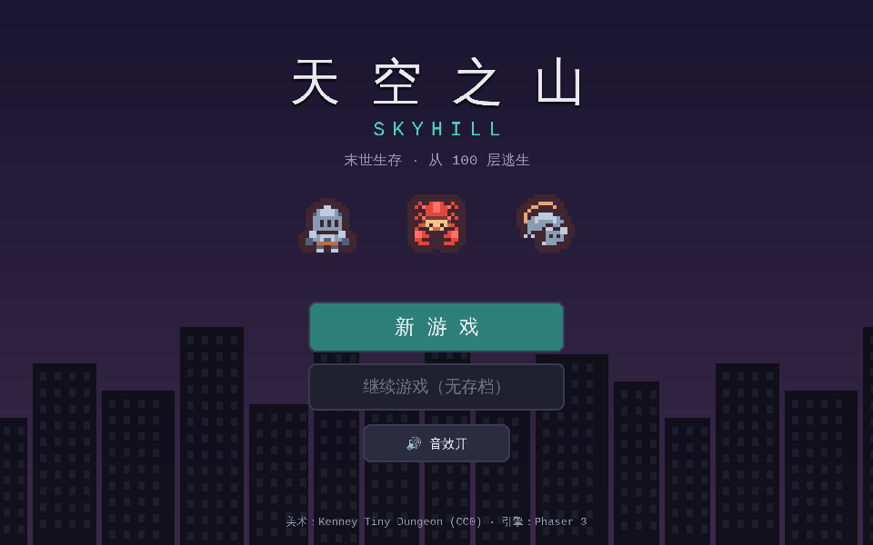
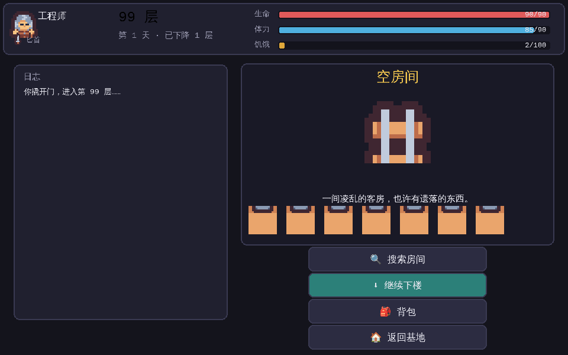
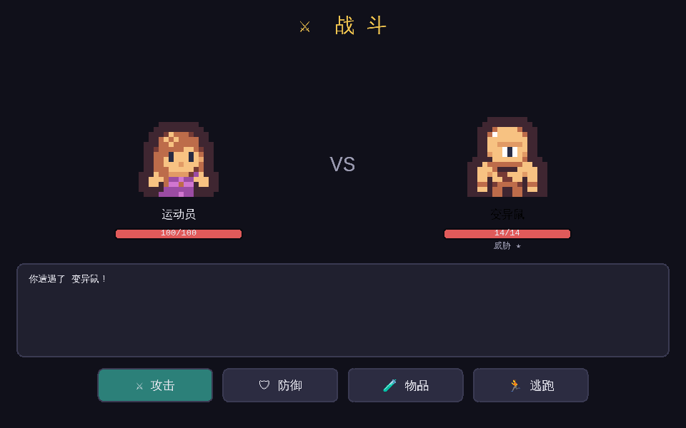

# 天空之山 · SkyHill（Web）

末世生存 Roguelike，灵感来自 *SkyHill*。生化战争爆发，你被困在 SkyHill 酒店 **100 层**顶层——
一路向下打到 **1 层**逃生，途中管理 **生命 / 体力 / 饥饿**，与变异怪战斗、搜刮物资、合成装备、回基地休整。

> 纯 Web，零运行时外部依赖（Phaser 本地内置）。像素美术为 **Kenney Tiny Dungeon (CC0)**。

| 主菜单 | 探索 | 战斗 |
|---|---|---|
|  |  |  |

## 运行

游戏使用 ES Module 与图片加载，需通过 HTTP 访问（不能直接双击 `file://` 打开）。任选其一起一个静态服务器：

```bash
# 方式一：Python（无需安装任何东西）
python3 -m http.server 8080
#  → 浏览器打开 http://localhost:8080

# 方式二：npm
npm start            # 等价于 python3 -m http.server 8080

# 方式三：Node 的 serve
npx serve .
```

## 玩法

- **选择职业**：保安（肉搏）/ 工程师（合成）/ 运动员（敏捷），属性与开局物资不同。
- **基地（顶层安全屋）**：睡觉恢复体力与少量 HP（但更饿）、在工作台/炉灶合成、整理背包，然后下楼探索。
- **探索**：每层一个房间——空房 / 物资间 / 怪物 / 上锁房（需**铁管**撬锁）/ 特殊房（休息点 / 缓存 / 陷阱）。越深怪越强、稀有掉落越好。
- **战斗（回合制）**：攻击 / 防御 / 用物品 / 逃跑。命中、伤害、闪避由属性与武器决定；部分怪附带**中毒**。
- **生存压力**：行动消耗体力，时间推进增加饥饿；饥饿满值持续掉血、恢复减半；体力耗尽强行动会掉血。
- **胜负**：抵达 1 层逃生 = 胜利；HP 归零或饿死 = 永久死亡（清档重开）。
- **存档**：自动保存到浏览器 `localStorage`，可从主菜单「继续游戏」。

完整规则与数值设计见 [`GAME_DESIGN.md`](GAME_DESIGN.md)。

## 项目结构

```
index.html              入口（内置 Phaser，加载 ES Module）
vendor/phaser.min.js    Phaser 3.80.1（本地内置）
assets/tilemap.png      Kenney Tiny Dungeon 精灵表（CC0）
src/
  data.js               所有内容数据：精灵帧 / 职业 / 物品 / 怪物 / 配方 / 房间 / 平衡
  state.js              游戏状态模型、背包/合成/下楼/睡觉逻辑、存档、RNG 与战斗数值
  ui.js                 主题色、按钮/状态条/精灵/面板组件、WebAudio 程序化音效
  hud.js                顶部状态栏（基地与探索共用）
  scenes/               Boot / Menu / ClassSelect / Base / Explore / Combat / Inventory / Craft / GameOver
tests/
  logic.mjs             纯逻辑回归（合成/用药/下楼/通关/背包上限…）
  smoke.mjs             端到端冒烟：自动玩一整局并截图，捕获控制台/页面错误
```

## 开发 / 测试

测试用 Playwright 驱动无头 Chromium（针对本仓库的 Web 开发环境配置）：

```bash
npm install            # 安装 playwright-core（devDependency）
python3 -m http.server 8080 &
npm test               # 逻辑测试 + 端到端冒烟
```

> 测试脚本里的 Chromium 路径（`/opt/pw-browsers/...`）是当前云端开发环境的预装路径；
> 在你本机跑测试时改成本机 Chrome/Chromium 路径即可。游戏本身**不需要** Node 或 Playwright。

## 致谢

- 美术：**Kenney — Tiny Dungeon**（CC0），详见 [`assets/CREDITS.md`](assets/CREDITS.md)
- 引擎：**Phaser 3**（MIT）
- 音效：程序化合成（WebAudio）

## 路线图（后续迭代）

- M5 美化：接入更多 CC0 美术与音效（BGM/打击感）、动画与转场
- 更多房间类型（商人 NPC、剧情碎片）、Boss 战、技能/天赋成长
- 更丰富的合成树与食物/烹饪系统、负重与道具稀有度
- 移动端触控适配与画面自适应
