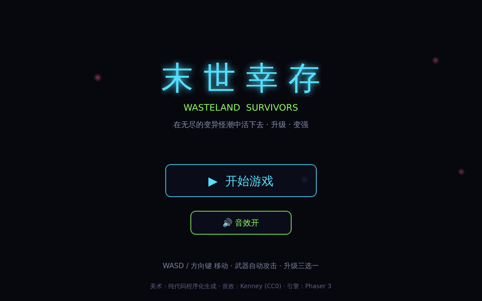
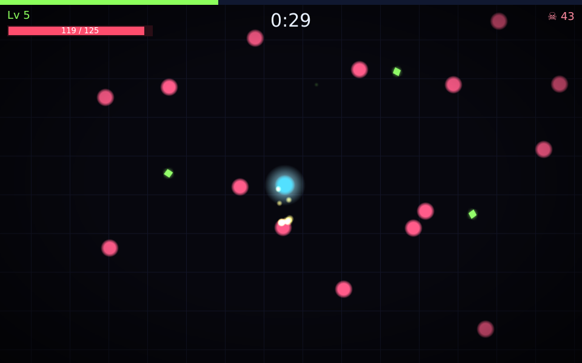
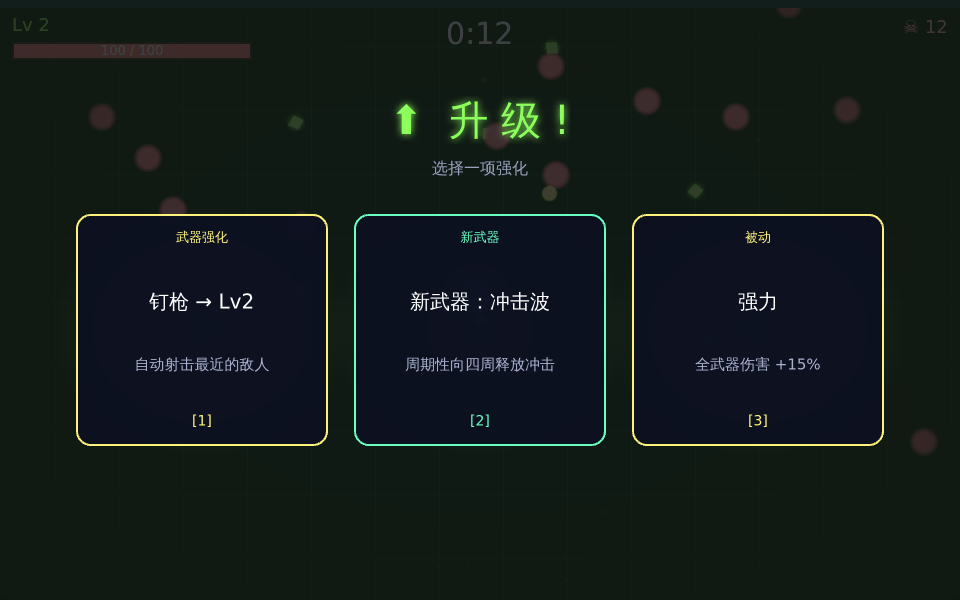

# 末世幸存 · Wasteland Survivors

一款 **Vampire Survivors 式**的霓虹幸存者游戏：你在末世废土中，无尽的变异怪从四面涌来，
**武器自动开火**，你只需走位、收集经验球、**升级三选一**变强，看能撑多久。

> 纯 Web · 零美术素材依赖（视觉全部**运行时程序化生成**：霓虹辉光 / 粒子 / 光环）· 引擎 Phaser 3。

| 主菜单 | 战斗 | 升级三选一 |
|---|---|---|
|  |  |  |

## 运行

需要通过 HTTP 访问（ES Module + canvas）：

```bash
python3 serve.py 8080     # 仓库根目录（已禁用缓存，避免旧 JS）
# 浏览器打开 http://localhost:8080
```

> 改动后浏览器记得 **硬刷新**（`Ctrl/Cmd + Shift + R`）。

## 玩法

- **移动**：`WASD` / 方向键（鼠标按住也可朝指针方向移动）。
- **战斗**：所有武器**自动攻击**最近的敌人，专注走位与取舍。
- **成长**：击杀掉落**经验球**，靠近自动吸取；升满经验**升级**，从 3 张卡里选 1：
  - 新武器（钉枪 / 霰弹 / 环刃 / 冲击波）
  - 武器升级（更高伤害 / 更快射速 / 更多弹丸 / 穿透）
  - 被动（生命 / 移速 / 伤害 / 射速 / 拾取范围 / 回血 / 护甲 / 经验）
- **压力**：怪潮随时间越来越密、越来越强；每 3 分钟刷新一只 **Boss**。
- **目标**：活得越久越好，刷新你的最长存活纪录。

## 视觉与手感（juice）

霓虹辉光 · 粒子爆炸 · 屏幕震动 · 受击顿帧 · 命中跳字闪烁 · 经验磁吸 · 升级镜头脉冲 · 暗角 · 漂浮光尘。
**全部由代码生成，不依赖任何图片素材。**

## 项目结构

```
index.html              入口
vendor/phaser.min.js    Phaser 3.80.1（本地内置）
serve.py                禁缓存开发服务器
assets/audio/sfx/       音效（Kenney CC0）
src/
  main.js               Phaser 入口 + 指针坐标修正
  game/
    data.js             调色板 / 敌人 / 武器 / 强化 / 平衡参数
    textures.js         运行时程序化霓虹贴图
    sfx.js              音效（复用 Kenney CC0 .ogg）
    ui.js               霓虹按钮 / 文本
    Boot.js Menu.js Game.js Upgrade.js GameOver.js
tests/
  smoke.mjs             端到端：开始→移动→自动战斗→升级，截图并捕获错误
```

## 致谢

- 音效：**Kenney**（Interface / RPG / Impact / Music Jingles，CC0）— 见 `assets/CREDITS.md`
- 引擎：**Phaser 3**（MIT）
- 美术：纯代码程序化生成（CC0 by construction）

## 后续可迭代

更多武器与进化、精英怪与多样攻击模式、更丰富的 Boss、被动叠加效果、逐帧角色精灵、移动端虚拟摇杆。
